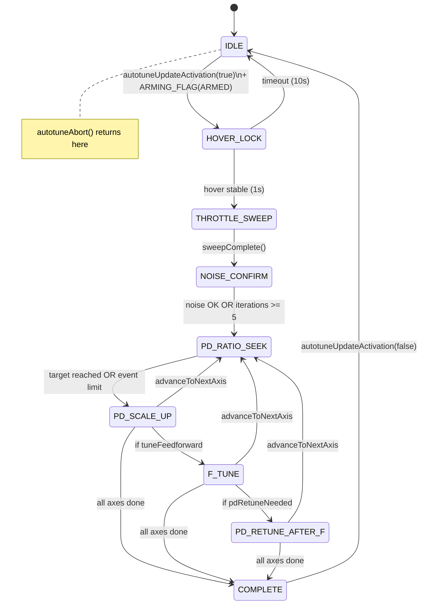
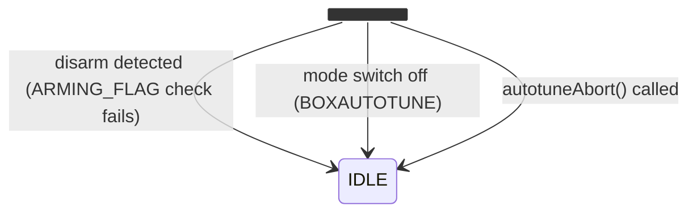

# State Flow Assessment — Autotune V2 Core State Machine — January 23, 2026

**Assessor:** State Workflow Lead Engineer  
**Code Version:** Current HEAD  
**PRD Version:** 2.0 (January 19, 2026)  
**Previous Assessment:** January 20, 2026

---

## 1. Executive Summary

### Overall Verdict: ⚠️ MOSTLY HEALTHY (Improved from "CONCERNING")

The state machine implementation is **substantially complete** and significant integration progress has been made since the last assessment. The module is now connected to the flight controller task scheduler with proper arming guards.

### Key Improvements Since Last Assessment

| Item | Jan 20 Status | Jan 23 Status |
|------|---------------|---------------|
| Integration (call sites) | ❌ Zero call sites | ✅ `taskAutotune` in tasks.c |
| `autotuneUpdate()` invoked | ❌ No | ✅ Yes, at 100Hz |
| `autotuneUpdateActivation()` invoked | ❌ No | ✅ Yes, on mode change |
| Disarm invariant enforced | ❓ Unknown | ✅ `ARMING_FLAG(ARMED)` checked |
| NOISE_CONFIRM infinite loop fix | ❌ Bug present | ✅ `noiseConfirmIterations` limiter added |

### Top Issues (Remaining)

| # | Severity | Issue | Impact |
|---|----------|-------|--------|
| 1 | 🟡 MEDIUM | `autotuneInit()` not called at startup | Module uses uninitialized state until first activation |
| 2 | 🟡 MEDIUM | NOISE_CONFIRM filter iteration bug | `tighterLpf` computed but never stored; iterations re-apply same filter |
| 3 | 🟡 MEDIUM | PRD safety behaviors not implemented | Sustained oscillation/overshoot abort per PRD 7.4 not coded |
| 4 | 🟢 LOW | No inactivity timeout in event-driven states | If pilot doesn't generate events, state machine waits indefinitely |
| 5 | 🟢 LOW | PRD shows AXIS_COMPLETE state; code uses helper | Documentation divergence, not functional |

### Intent vs Reality Summary

| Aspect | PRD Intent | Code Reality | Gap |
|--------|------------|--------------|-----|
| State sequence | IDLE → HOVER_LOCK → THROTTLE_SWEEP → NOISE_CONFIRM → AXIS_LOOP → COMPLETE | ✅ Matches | None |
| Axis loop | Roll → Pitch → Yaw (configurable) | ✅ `advanceToNextAxisOrComplete()` | None |
| Filter-first | Filters tuned before gains | ✅ Implemented correctly | None |
| Single event decisions | One maneuver = one decision | ✅ Implemented correctly | None |
| Rollback on regression | Rollback available for P, D, F | ✅ Implemented correctly | None |
| Disarm safety | Autotune aborts on disarm | ✅ `ARMING_FLAG(ARMED)` guard in task | None |
| Abort semantics | Hard safety aborts defined | ⚠️ `autotuneAbort()` exists, but PRD triggers not all coded | Minor |

---

## 2. State Inventory

### 2.1 Explicit States (from `autotuneState_e` in [autotune_types.h#L49-L60](src/main/flight/autotune_v2/autotune_types.h#L49-L60))

| Enum Value | State Name | Index |
|------------|------------|-------|
| `AUTOTUNE_STATE_IDLE` | Inactive/waiting | 0 |
| `AUTOTUNE_STATE_HOVER_LOCK` | Stable hover detection | 1 |
| `AUTOTUNE_STATE_THROTTLE_SWEEP` | Filter characterization | 2 |
| `AUTOTUNE_STATE_NOISE_CONFIRM` | Validate filter settings | 3 |
| `AUTOTUNE_STATE_PD_RATIO_SEEK` | Find critical damping | 4 |
| `AUTOTUNE_STATE_PD_SCALE_UP` | Scale P and D together | 5 |
| `AUTOTUNE_STATE_F_TUNE` | Feedforward tuning | 6 |
| `AUTOTUNE_STATE_PD_RETUNE_AFTER_F` | Re-validate P/D | 7 |
| `AUTOTUNE_STATE_COMPLETE` | Tuning finished | 8 |
| `AUTOTUNE_STATE_COUNT` | (Sentinel) | 9 |

### 2.2 Substates (from `axisSubstate_e` in [autotune_types.h#L62-L68](src/main/flight/autotune_v2/autotune_types.h#L62-L68))

| Enum Value | Substate Name | Usage Status |
|------------|---------------|--------------|
| `AXIS_SUBSTATE_WAIT_EVENT` | Waiting for pilot maneuver | ✅ Active |
| `AXIS_SUBSTATE_ANALYZING` | Computing metrics | ✅ Active |
| `AXIS_SUBSTATE_APPLYING` | Applying parameter change | ⚠️ TODO stub |
| `AXIS_SUBSTATE_CONFIRMING` | Waiting for confirmation | ⚠️ TODO stub |

### 2.3 Axes/Modes Affecting Transitions

| Mode/Axis | Representation | Where Set | Affects Transitions? |
|-----------|----------------|-----------|---------------------|
| Current Axis | `runtime.currentAxisIndex` | `advanceToNextAxisOrComplete()` | Yes - loops states per axis |
| Axis Mask | `autotuneConfig()->axes` | Configuration | Yes - filters which axes |
| Tune Feedforward | `autotuneConfig()->tuneFeedforward` | Configuration | Yes - skips F_TUNE if disabled |
| PD Retune Flag | `axis->pdRetuneNeeded` | Runtime | Yes - gates PD_RETUNE_AFTER_F |

---

## 3. State Flow Diagram(s)

### 3.1 Master State Flow (Common Path)



### 3.2 Abort/Deactivation Flow



**Implementation:** [tasks.c#L264-L269](src/main/fc/tasks.c#L264)
```c
const bool autotuneEnabled = ARMING_FLAG(ARMED) && IS_RC_MODE_ACTIVE(BOXAUTOTUNE);
if (autotuneEnabled != lastAutotuneEnabled) {
    autotuneUpdateActivation(autotuneEnabled, currentTimeUs);
    ...
}
```

---

## 4. Per-State Contracts

### 4.1 IDLE

| Aspect | Details |
|--------|---------|
| **Mission** | PRD: "autotune OFF or disarmed" |
| **Entry Conditions** | Initial state, OR `autotuneAbort()` called, OR `autotuneUpdateActivation(false)` |
| **Entry Guard Code** | [autotune_core.c#L1747-L1754](src/main/flight/autotune_v2/autotune_core.c#L1747) |
| **Exit Conditions** | `autotuneUpdateActivation(true)` AND `ARMING_FLAG(ARMED)` |
| **Exit Guard Code** | [tasks.c#L264](src/main/fc/tasks.c#L264) |
| **Actions** | Reset reason code, clear decision |
| **Timeout/Abort** | N/A (starting state) |
| **Risks** | ⚠️ `autotuneInit()` not called - relies on zero-initialized state |

### 4.2 HOVER_LOCK

| Aspect | Details |
|--------|---------|
| **Mission** | PRD: "Detect stable hover, capture hover throttle + baseline noise" |
| **Entry Conditions** | From IDLE when autotune activated |
| **Entry Guard Code** | [autotune_core.c#L1761-1785](src/main/flight/autotune_v2/autotune_core.c#L1761) |
| **Exit Conditions (Success)** | Sticks centered + throttle stable for 1 second |
| **Exit Code** | [autotune_core.c#L210-L215](src/main/flight/autotune_v2/autotune_core.c#L210-L215) |
| **Exit Conditions (Failure)** | 10 second timeout → IDLE |
| **Timeout Code** | [autotune_core.c#L200-L208](src/main/flight/autotune_v2/autotune_core.c#L200-L208) |
| **Actions** | Track throttle stability, reset timer on instability |
| **Feedback** | `autotuneFeedbackHoverLocked()` on success |
| **Risks** | ✅ None - timeout correctly implemented |

### 4.3 THROTTLE_SWEEP

| Aspect | Details |
|--------|---------|
| **Mission** | PRD: "Characterize noise vs throttle, adjust filters" |
| **Entry Conditions** | From HOVER_LOCK after hover locked |
| **Entry Guard Code** | [autotune_core.c#L215](src/main/flight/autotune_v2/autotune_core.c#L215) |
| **Exit Conditions** | `autotuneFilterSweepComplete()` returns true |
| **Exit Code** | [autotune_core.c#L270-L282](src/main/flight/autotune_v2/autotune_core.c#L270-L282) |
| **Actions** | Update filter characterization, track throttle range |
| **Timeout/Abort** | ⚠️ Relies on `checkTimeouts()` global timeout |
| **Risks** | LOW - pilot controls when sweep completes |

### 4.4 NOISE_CONFIRM

| Aspect | Details |
|--------|---------|
| **Mission** | PRD: "Validate filter settings, iterate if noise too high" |
| **Entry Conditions** | From THROTTLE_SWEEP when sweep complete |
| **Entry Guard Code** | [autotune_core.c#L282](src/main/flight/autotune_v2/autotune_core.c#L282) |
| **Exit Conditions (Success)** | Noise acceptable after 500ms settling |
| **Exit Code** | [autotune_core.c#L322-L327](src/main/flight/autotune_v2/autotune_core.c#L322-L327) |
| **Exit Conditions (Max Iterations)** | `noiseConfirmIterations >= 5` → proceed anyway |
| **Exit Code (Fallback)** | [autotune_core.c#L322](src/main/flight/autotune_v2/autotune_core.c#L322) |
| **Escape Guaranteed?** | ✅ YES - iteration limiter added |
| **Known Bug** | ⚠️ `tighterLpf` computed but never stored - filter isn't actually tightened |
| **Bug Location** | [autotune_core.c#L333-L351](src/main/flight/autotune_v2/autotune_core.c#L333-L351) |
| **Risks** | MEDIUM - bug causes wasted iterations but escape is guaranteed |

### 4.5 PD_RATIO_SEEK

| Aspect | Details |
|--------|---------|
| **Mission** | PRD: "D fixed, sweep P only. Target: near-critical damping" |
| **Entry Conditions** | From NOISE_CONFIRM when noise OK (or iterations exhausted) |
| **Entry Guard Code** | [autotune_core.c#L430-L480](src/main/flight/autotune_v2/autotune_core.c#L430) |
| **Exit Conditions (Success)** | Target overshoot reached |
| **Exit Code** | [autotune_core.c#L577-L580](src/main/flight/autotune_v2/autotune_core.c#L577-L580) |
| **Exit Conditions (Limit)** | Event limit reached |
| **Exit Code** | [autotune_core.c#L585-L590](src/main/flight/autotune_v2/autotune_core.c#L585-L590) |
| **Actions** | Bracket + Newton search for optimal P |
| **Timeout** | Per-axis timeout via `checkTimeouts()` |
| **Risks** | ✅ None - Newton + bracket convergence robust |

### 4.6 PD_SCALE_UP

| Aspect | Details |
|--------|---------|
| **Mission** | PRD: "Scale P & D together proportionally. Target: fastest response" |
| **Entry Conditions** | From PD_RATIO_SEEK when target reached |
| **Entry Guard Code** | [autotune_core.c#L632-L670](src/main/flight/autotune_v2/autotune_core.c#L632) |
| **Exit Conditions** | Lag target met OR gain limit OR instability |
| **Exit Code** | [autotune_core.c#L756-L767](src/main/flight/autotune_v2/autotune_core.c#L756-L767) |
| **Actions** | Newton estimation for scale factor |
| **Risks** | ✅ None - consecutive bad event tracking forces advance |

### 4.7 F_TUNE

| Aspect | Details |
|--------|---------|
| **Mission** | PRD: "Tune feedforward for reduced lag" |
| **Entry Conditions** | From PD_SCALE_UP if `tuneFeedforward` enabled |
| **Entry Guard Code** | [autotune_core.c#L837-L870](src/main/flight/autotune_v2/autotune_core.c#L837) |
| **Exit Conditions** | Lag target met OR F limit OR overshoot regression |
| **Exit Code** | [autotune_core.c#L963-L973](src/main/flight/autotune_v2/autotune_core.c#L963-L973) |
| **PD Retune Flag** | `axis->pdRetuneNeeded` set if overshoot > 1.3× target |
| **Risks** | ✅ None |

### 4.8 PD_RETUNE_AFTER_F

| Aspect | Details |
|--------|---------|
| **Mission** | PRD: "Quick re-validation of P/D after F change" |
| **Entry Conditions** | From F_TUNE if `pdRetuneNeeded` |
| **Entry Guard Code** | [autotune_core.c#L1007-L1030](src/main/flight/autotune_v2/autotune_core.c#L1007) |
| **Exit Conditions** | Overshoot OK OR 3 events max |
| **Exit Code** | [autotune_core.c#L1091-L1100](src/main/flight/autotune_v2/autotune_core.c#L1091-L1100) |
| **Risks** | ✅ None |

### 4.9 COMPLETE

| Aspect | Details |
|--------|---------|
| **Mission** | PRD: "Tuning finished successfully" |
| **Entry Conditions** | All axes complete |
| **Entry Guard Code** | [autotune_core.c#L1543-L1550](src/main/flight/autotune_v2/autotune_core.c#L1543) |
| **Exit Conditions** | `autotuneUpdateActivation(false)` → IDLE |
| **Actions** | Trigger completion feedback |
| **Risks** | ✅ None - terminal state as intended |

---

## 5. Graph Correctness Checks

### 5.1 Unreachable States

| State | Status | Evidence |
|-------|--------|----------|
| All 9 states | ✅ Reachable | Traced from IDLE through all paths |

### 5.2 Sticky States (No Exit)

| State | Status | Evidence |
|-------|--------|----------|
| NOISE_CONFIRM | ✅ FIXED | `noiseConfirmIterations >= 5` guarantees exit ([L322](src/main/flight/autotune_v2/autotune_core.c#L322)) |
| Event-driven states | ⚠️ LOW | Global timeout exists via `checkTimeouts()` but per-state inactivity timeouts not implemented |

### 5.3 Cycles Without Progress

| Cycle | Status | Notes |
|-------|--------|-------|
| NOISE_CONFIRM iterations | ✅ FIXED | Max 5 iterations |
| Axis loop | ✅ OK | `advanceToNextAxisOrComplete()` ensures forward progress |
| PD Ratio/Scale | ✅ OK | `consecutiveBadEvents` tracking forces advance after 3 failures |

### 5.4 Conflicting Guards

| Location | Status | Notes |
|----------|--------|-------|
| All transitions | ✅ OK | Guards are mutually exclusive |

### 5.5 Terminal States

| State | Intended? | Notes |
|-------|-----------|-------|
| COMPLETE | ✅ Yes | Stays until deactivated |
| IDLE | ✅ Yes | Waits for activation |

---

## 6. PRD Traceability + Mismatch Analysis

### 6.1 State Mapping

| PRD State | Code State | Match |
|-----------|------------|-------|
| IDLE | AUTOTUNE_STATE_IDLE | ✅ |
| HOVER_LOCK | AUTOTUNE_STATE_HOVER_LOCK | ✅ |
| THROTTLE_SWEEP_FILTER_CHAR | AUTOTUNE_STATE_THROTTLE_SWEEP | ✅ |
| NOISE_CONFIRM | AUTOTUNE_STATE_NOISE_CONFIRM | ✅ |
| AXIS_LOOP (implied) | Multiple states + axis tracking | ✅ |
| PD_RATIO_SEEK | AUTOTUNE_STATE_PD_RATIO_SEEK | ✅ |
| PD_SCALE_UP | AUTOTUNE_STATE_PD_SCALE_UP | ✅ |
| F_TUNE | AUTOTUNE_STATE_F_TUNE | ✅ |
| AXIS_COMPLETE (PRD diagram) | Helper function | ⚠️ Minor divergence |
| COMPLETE | AUTOTUNE_STATE_COMPLETE | ✅ |

### 6.2 Mismatch Categories

| Mismatch | Category | Notes |
|----------|----------|-------|
| AXIS_COMPLETE not a state | Implementation detail | PRD diagram shows it; code uses helper |
| PRD safety aborts not all coded | PRD underspecified | Oscillation/overshoot abort triggers TBD |
| Inactivity timeouts | PRD underspecified | PRD mentions timeouts but doesn't specify per-state |

---

## 7. Issue List (Handoff-Ready)

### SFA-001: `autotuneInit()` Not Called at Startup

| Field | Value |
|-------|-------|
| **ID** | SFA-001 |
| **Severity** | 🟡 MEDIUM |
| **Symptom** | Module may use uninitialized memory until first activation |
| **Evidence** | [tasks.c#L421](src/main/fc/tasks.c#L421): `DEFINE_TASK("AUTOTUNE", NULL, NULL, taskAutotune, ...)` — init callback is NULL |
| **Suspected Cause** | Integration incomplete — init call not wired up |
| **Suggested Fix** | Add `autotuneInit` as task init function OR call from `init.c` |
| **Validation** | Verify `runtime` struct is properly initialized before first use |

---

### SFA-002: NOISE_CONFIRM Filter Not Actually Tightened

| Field | Value |
|-------|-------|
| **ID** | SFA-002 |
| **Severity** | 🟡 MEDIUM |
| **Symptom** | Noise confirm iterations waste time but don't improve filtering |
| **Evidence** | [autotune_core.c#L333-L351](src/main/flight/autotune_v2/autotune_core.c#L333-L351): `tighterLpf` is computed but never stored to `filterState.recommendedLpf` |
| **Suspected Cause** | Incomplete implementation |
| **Suggested Fix** | Add `autotuneFilterSetRecommendedLpf(tighterLpf)` call before reapply |
| **Validation** | Blackbox log should show decreasing LPF values on each iteration |

---

### SFA-003: PRD Safety Behaviors Not Implemented

| Field | Value |
|-------|-------|
| **ID** | SFA-003 |
| **Severity** | 🟡 MEDIUM |
| **Symptom** | PRD 7.4 defines abort on "sustained oscillation" and "excessive overshoot" but conditions not coded |
| **Evidence** | PRD 7.4 safety requirements vs `autotuneAbort()` trigger conditions |
| **Suspected Cause** | Phase 5 work incomplete |
| **Suggested Fix** | Define thresholds and implement detection in event analysis loop |
| **Validation** | Unit test abort triggers |

---

### SFA-004: No Per-State Inactivity Timeout

| Field | Value |
|-------|-------|
| **ID** | SFA-004 |
| **Severity** | 🟢 LOW |
| **Symptom** | If pilot hovers without performing maneuvers, event-driven states wait indefinitely |
| **Evidence** | States 4-7 rely on `WAIT_EVENT` substate with no time limit |
| **Suspected Cause** | Design relies on global timeout (3 min) rather than per-state |
| **Suggested Fix** | Add per-state inactivity timeouts (~30s) with "waiting for input" feedback |
| **Validation** | Let state machine idle, verify timeout transition |

---

### SFA-005: Unused Substates

| Field | Value |
|-------|-------|
| **ID** | SFA-005 |
| **Severity** | 🟢 LOW |
| **Symptom** | `AXIS_SUBSTATE_APPLYING` and `AXIS_SUBSTATE_CONFIRMING` defined but never entered |
| **Evidence** | [autotune_core.c#L597-L601](src/main/flight/autotune_v2/autotune_core.c#L597-L601): `// TODO: Phase 3 implementation` |
| **Suspected Cause** | Placeholder for future work |
| **Suggested Fix** | Either implement or remove unused substates |
| **Validation** | Code review |

---

## Appendix A: Integration Status (Updated)

### A.1 Call-Site Audit

| Function | Call Site | Status |
|----------|-----------|--------|
| `autotuneInit()` | None | ⚠️ NOT CALLED |
| `autotuneUpdate()` | [tasks.c#L274](src/main/fc/tasks.c#L274) | ✅ Called |
| `autotuneUpdateActivation()` | [tasks.c#L268](src/main/fc/tasks.c#L268) | ✅ Called |
| `autotuneAbort()` | Internal only | ✅ OK (called by UpdateActivation) |

### A.2 Task Definition

**Location:** [tasks.c#L421](src/main/fc/tasks.c#L421)

```c
[TASK_AUTOTUNE] = DEFINE_TASK("AUTOTUNE", NULL, NULL, taskAutotune, TASK_PERIOD_HZ(100), TASK_PRIORITY_MEDIUM),
```

- **Rate:** 100 Hz
- **Priority:** MEDIUM
- **Init function:** NULL ← Issue SFA-001
- **Task function:** `taskAutotune`

### A.3 Disarm Invariant

**Invariant:** `autotuneIsActive() == true` ⟹ `ARMING_FLAG(ARMED) == true`

**Enforcement:** [tasks.c#L264](src/main/fc/tasks.c#L264)

```c
const bool autotuneEnabled = ARMING_FLAG(ARMED) && IS_RC_MODE_ACTIVE(BOXAUTOTUNE);
```

**Verification:** ✅ When quad disarms, `ARMING_FLAG(ARMED)` becomes false, causing `autotuneEnabled` to become false on next task iteration, triggering `autotuneUpdateActivation(false, ...)` which calls `autotuneAbort()` → transitions to IDLE.

---

## Appendix B: Code References

| File | Purpose | Key Functions |
|------|---------|---------------|
| [autotune_types.h](src/main/flight/autotune_v2/autotune_types.h) | Type definitions | States, substates, structs |
| [autotune_core.c](src/main/flight/autotune_v2/autotune_core.c) | State machine | `transitionToState()`, all handlers |
| [autotune_core.h](src/main/flight/autotune_v2/autotune_core.h) | Public API | `autotuneInit()`, `autotuneUpdate()`, `autotuneAbort()` |
| [autotune_debug.h](src/main/flight/autotune_v2/autotune_debug.h) | Constants | Timeouts, thresholds, reason codes |
| [tasks.c](src/main/fc/tasks.c) | Integration | `taskAutotune()`, task definition |

---

## Appendix C: Changes Since Last Assessment

| Date | Change | Issue Addressed |
|------|--------|-----------------|
| Jan 21-23 | Added `taskAutotune` in tasks.c | Previous SFA-001 (was blocking) |
| Jan 21-23 | Added `noiseConfirmIterations` limiter | Previous SFA-006 (NOISE_CONFIRM escape) |
| Jan 21-23 | Wired `autotuneUpdateActivation()` to task | Disarm invariant |
| Jan 21-23 | Added `TASK_AUTOTUNE` at 100Hz | Integration |
| Jan 21-23 | Added `setTaskEnabled(TASK_AUTOTUNE, true)` | Task activation |

---

## Appendix D: Transition Edge Audit

### D.1 All `transitionToState()` Calls

| From State | To State | Location | Guard |
|------------|----------|----------|-------|
| IDLE | HOVER_LOCK | [L1773](src/main/flight/autotune_v2/autotune_core.c#L1773) | `autotuneUpdateActivation(true)` |
| HOVER_LOCK | IDLE | [L205](src/main/flight/autotune_v2/autotune_core.c#L205) | 10s timeout |
| HOVER_LOCK | THROTTLE_SWEEP | [L215](src/main/flight/autotune_v2/autotune_core.c#L215) | Hover stable 1s |
| THROTTLE_SWEEP | NOISE_CONFIRM | [L282](src/main/flight/autotune_v2/autotune_core.c#L282) | `sweepComplete()` |
| NOISE_CONFIRM | PD_RATIO_SEEK | [L327](src/main/flight/autotune_v2/autotune_core.c#L327) | Noise OK OR max iterations |
| NOISE_CONFIRM | PD_RATIO_SEEK | [L344](src/main/flight/autotune_v2/autotune_core.c#L344) | LPF at minimum |
| PD_RATIO_SEEK | PD_SCALE_UP | [L580](src/main/flight/autotune_v2/autotune_core.c#L580) | Target reached |
| PD_RATIO_SEEK | PD_SCALE_UP | [L589](src/main/flight/autotune_v2/autotune_core.c#L589) | Event limit |
| PD_SCALE_UP | F_TUNE | [L764](src/main/flight/autotune_v2/autotune_core.c#L764) | tuneFeedforward |
| PD_SCALE_UP | → advanceToNextAxisOrComplete | [L766](src/main/flight/autotune_v2/autotune_core.c#L766) | !tuneFeedforward |
| F_TUNE | PD_RETUNE_AFTER_F | [L968](src/main/flight/autotune_v2/autotune_core.c#L968) | pdRetuneNeeded |
| F_TUNE | → advanceToNextAxisOrComplete | [L970](src/main/flight/autotune_v2/autotune_core.c#L970) | !pdRetuneNeeded |
| PD_RETUNE_AFTER_F | → advanceToNextAxisOrComplete | [L1098](src/main/flight/autotune_v2/autotune_core.c#L1098) | Overshoot OK |
| Any | IDLE | [L1750](src/main/flight/autotune_v2/autotune_core.c#L1750) | `autotuneAbort()` |
| → advanceToNextAxisOrComplete | COMPLETE | [L1141](src/main/flight/autotune_v2/autotune_core.c#L1141) | All axes done |
| → advanceToNextAxisOrComplete | PD_RATIO_SEEK | [L1136](src/main/flight/autotune_v2/autotune_core.c#L1136) | Next axis found |

---

*Assessment generated by State Workflow Lead Engineer*  
*Last updated: January 23, 2026*
